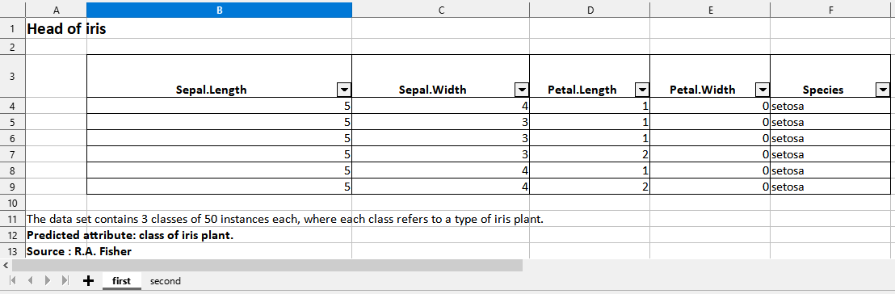

<!-- badges: start -->

<!-- badges: end -->

:package: Package `tablexlsx` 
======================================

R package that allows to export data frames from R to xslx workbooks

## Installation

``` r
remotes::install_github("ddotta/tablexlsx")
```

``` r
library(tablexlsx)
```

## Why this package ?

This package is a  wrapper of some functions from the great [openxlsx](https://github.com/ycphs/openxlsx) package.  

The purpose of this package is to meet the needs of R users who want to export data frames in `xlsx` files to share their data and results with other users not necessarily R users.  

The goal is to get an API that is as simple as possible to use. The package will be improved over time and will include features such as the possibility to highlight in excel files some remarkable rows/columns (for example totals or coefficients...).

## Examples

This package will allow you to make exports in xlsx format, whether they are simple or very customized :

:one: Simply export a data frame to an xlsx file 

``` r
iris %>% toxlsx(path = "mypath")
```

:two: Export a list of several data frames to an xlsx file (each data frame in a different sheet)

``` r
list(iris,mtcars) %>% toxlsx(path = "mypath")
```

:three: Export a list of data frames to an xlsx file by specifying which data frame goes in which sheet, styling each column, giving a title and footnotes...

``` r
iris <- iris %>% head()
cars <- cars %>% head()

list(iris,cars) %>%
  toxlsx(tosheet = list("iris" = "first",
                        "cars" = "second"),
         title = list("iris" = "Head of iris",
                      "cars" = "Head of cars"),
         # The `columnstyle` argument is optional in toxlsx(). 
         # It is used only if you want to specify the format of each column
         columnstyle = list("iris" = list("c1" = "decimal",
                                          "c2" = "decimal",
                                          "c3" = "number",
                                          "c4" = "number",
                                          "c5" = "character"),
                            "cars" =  list("c1" = "number",
                                           "c2" = "number")),
         footnote1 = list("iris" = "The data set contains 3 classes of 50 instances each, where each class refers to a type of iris plant.",
                           "cars" = "The data give the speed of cars and the distances taken to stop. Note that the data were recorded in the 1920s."),
         footnote2 = list("iris" = "Predicted attribute: class of iris plant.",
                           "cars" = "Data recorded in the 1920s"),
         footnote3 = list("iris" = "Source : R.A. Fisher",
                           "cars" = "Source : M. Ezekiel"),
         path = "mypath")
```

Preview of the xlsx file in LibreOffice Calc with the 2 data frames in the 2 separates sheets :  


