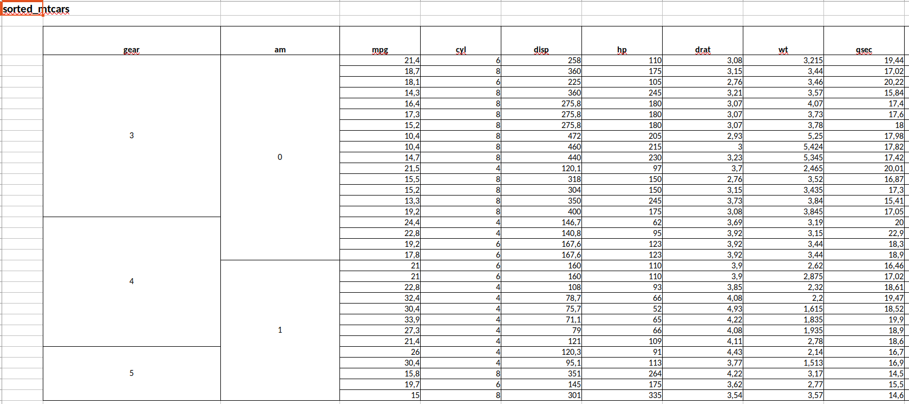
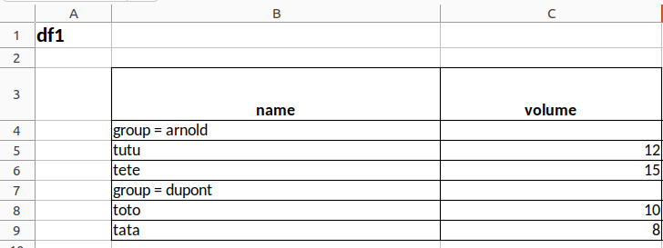
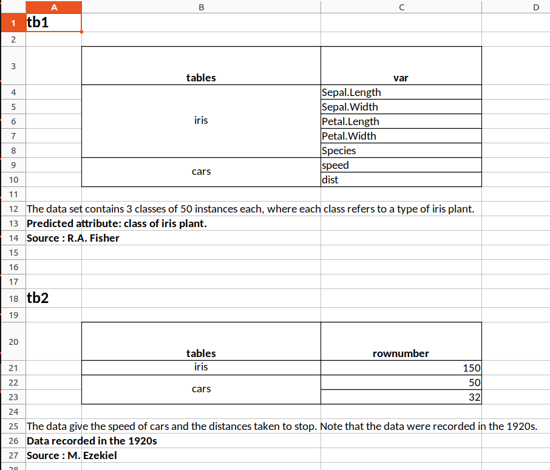
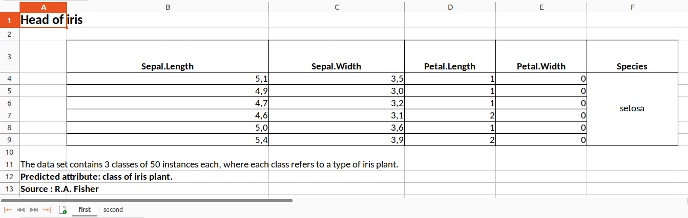

# Examples gallery

``` r
library(tablexlsx)
library(magrittr)
```

## Examples gallery

### Table of Contents

1.  [Simply export a data frame to an xlsx
    file](#simply-export-a-data-frame-to-an-xlsx-file)
2.  [Export a list of several data frames to an xlsx file (each data
    frame in a different
    sheet)](#export-a-list-of-several-data-frames-to-an-xlsx-file-each-data-frame-in-a-different-sheet)
3.  [Export a data frame to an xlsx file (merging modalities for one
    column)](#export-a-data-frame-to-an-xlsx-file-merging-modalities-for-one-column)
4.  [Export a data frame to an xlsx file (merging modalities for several
    columns)](#export-a-data-frame-to-an-xlsx-file-merging-modalities-for-several-columns)
5.  [Export a data frame to an xlsx file (splitting the data frame into
    groups)](#export-a-data-frame-to-an-xlsx-file-splitting-the-data-frame-into-groups)
6.  [Export a list of several data frames to an xlsx file (several data
    frames in a same
    sheet)](#export-a-list-of-several-data-frames-to-an-xlsx-file-several-data-frames-in-a-same-sheet)
7.  [Export a list of data frames to an named xlsx file by specifying
    which data frame goes in which sheet, styling each column, giving a
    title and
    footnotes…](#export-a-list-of-data-frames-to-an-named-xlsx-file-by-specifying-which-data-frame-goes-in-which-sheet-styling-each-column-giving-a-title-and-footnotes)

Let’s define an export folder that will be the same for all the examples
on this page

``` r
mypath <- tempdir()
```

> Important : in this vignette, all examples use `%>%` to pass the
> `object` argument in the [`toxlsx()`](../reference/toxlsx.md)
> function, but it works interchangeably with these 3 syntaxes below :

``` r
toxlsx(object = iris, path = mypath)
iris |> toxlsx(path = mypath)
iris %>% toxlsx(path = mypath)
```

### 1. Simply export a data frame to an xlsx file

``` r
iris |> toxlsx(path = mypath)
```

Preview of the xlsx file in LibreOffice Calc :


### 2. Export a list of several data frames to an xlsx file (each data frame in a different sheet)

``` r
list(iris,cars) |> toxlsx(path = mypath)
```

Preview of the xlsx file in LibreOffice Calc :


### 3. Export a data frame to an xlsx file (merging modalities for one column)

``` r
# Create df1
df1 <- data.frame(
  group = c("dupont","dupont","arnold","arnold"),
  name = c("toto","tata","tutu","tete"),
  volume = c(10,8,12,15)
)
#  Export
df1 |> toxlsx(path = mypath, mergecol = "group")
```

Preview of the xlsx file in LibreOffice Calc :


### 4. Export a data frame to an xlsx file (merging modalities for several columns)

``` r
sorted_mtcars <- mtcars[
  order(mtcars$gear, mtcars$am),
  c("gear", "am", setdiff(names(mtcars), c("gear", "am")))
  ]

sorted_mtcars |>
  toxlsx(path = mypath, mergecol = c("gear", "am"))
```

Preview of the xlsx file in LibreOffice Calc :



### 5. Export a data frame to an xlsx file (splitting the data frame into groups)

``` r
df1 |> toxlsx(path = mypath, bygroup= "group", groupname=TRUE)
```



### 6. Export a list of several data frames to an xlsx file (several data frames in a same sheet)

``` r
tb1 <- data.frame(tables = c(rep("iris",5),rep("cars",2)),
                  var = c(names(iris),names(cars)))

tb2 <- data.frame(tables = c("iris","cars","cars"),
                  rownumber = c(150,50,32))

list(tb1,tb2) |>
  toxlsx(tosheet = "mydata",
         mergecol = "tables",
         footnote1 = list("tb1" = "The data set contains 3 classes of 50 instances each, where each class refers to a type of iris plant.",
                          "tb2" = "The data give the speed of cars and the distances taken to stop. Note that the data were recorded in the 1920s."),
         footnote2 = list("tb1" = "Predicted attribute: class of iris plant.",
                          "tb2" = "Data recorded in the 1920s"),
         footnote3 = list("tb1" = "Source : R.A. Fisher",
                          "tb2" = "Source : M. Ezekiel"),
         path=mypath)
```

Note that the arguments `tosheet` and `mergecol`, being length-one
character vectors, are recycled for all data frames of the list.

Preview of the xlsx file in LibreOffice Calc :



### 7. Export a list of data frames to an named xlsx file by specifying which data frame goes in which sheet, styling each column, giving a title and footnotes…

``` r
iris <- iris %>% head()
cars <- cars %>% head()

list(iris,cars) |>
  toxlsx(tosheet = list("iris" = "first",
                        "cars" = "second"),
         title = list("iris" = "Head of iris",
                      "cars" = "Head of cars"),
         mergecol = list("iris" = "Species",
                         "cars" = "speed"),
         # The `columnstyle` argument is optional in toxlsx(). 
         # It is used only if you want to specify the format of each column
         columnstyle = list("iris" = list("c1" = "decimal",
                                          "c2" = "decimal",
                                          "c3" = "number",
                                          "c4" = "number",
                                          "c5" = "character"),
                            "cars" =  list("c1" = "number",
                                           "c2" = "number")),
         footnote1 = list("iris" = "The data set contains 3 classes of 50 instances each, where each class refers to a type of iris plant.",
                           "cars" = "The data give the speed of cars and the distances taken to stop. Note that the data were recorded in the 1920s."),
         footnote2 = list("iris" = "Predicted attribute: class of iris plant.",
                           "cars" = "Data recorded in the 1920s"),
         footnote3 = list("iris" = "Source : R.A. Fisher",
                           "cars" = "Source : M. Ezekiel"),
         filename = "Results",
         path = mypath)
```

The equivalent with the {openxlsx} syntax would be much longer and more
painful to write.

Preview of the xlsx file in LibreOffice Calc :


