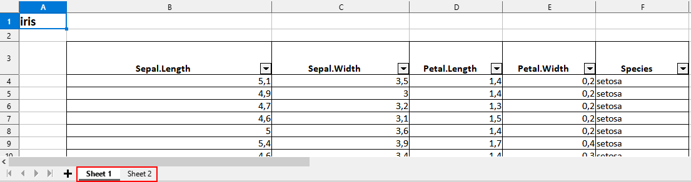
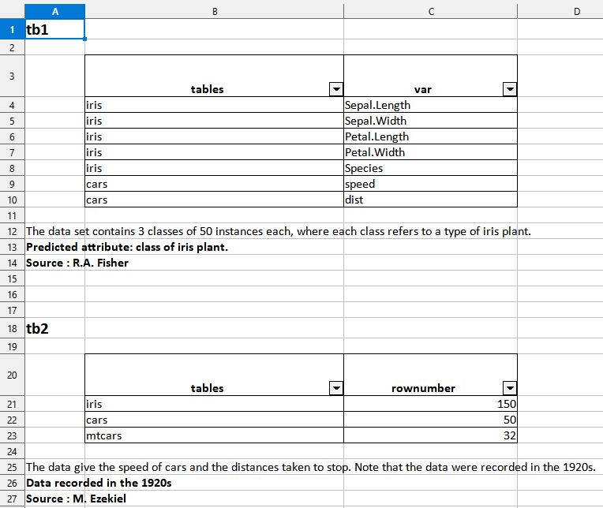
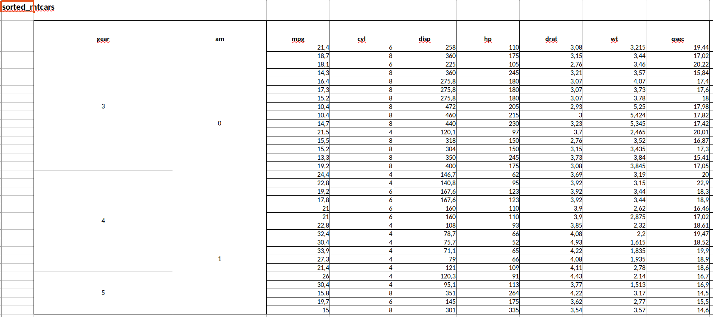
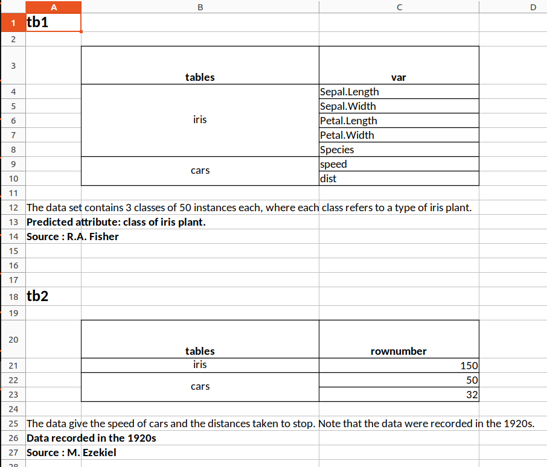
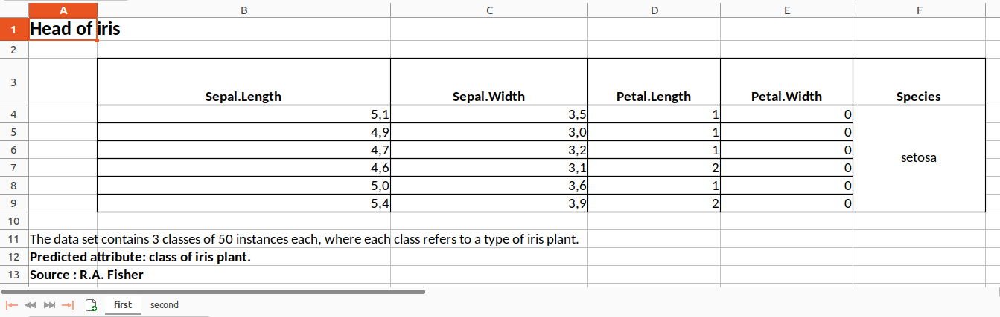

```{r, include = FALSE}
knitr::opts_chunk$set(
  collapse = TRUE,
  comment = "#>"
)
options(rmarkdown.html_vignette.check_title = FALSE)
```

```{r setup}
library(tablexlsx)
library(dplyr, warn.conflicts = FALSE)
```

# Examples gallery

## Table of Contents
1. [Simply export a data frame to an xlsx file ](#simply-export-a-data-frame-to-an-xlsx-file)
2. [Export a list of several data frames to an xlsx file (each data frame in a different sheet)](#export-a-list-of-several-data-frames-to-an-xlsx-file-each-data-frame-in-a-different-sheet)
3. [Export a data frame to an xlsx file (merging modalities for one column)](#export-a-data-frame-to-an-xlsx-file-merging-modalities-for-one-column)
4. [Export a data frame to an xlsx file (merging modalities for several columns)](#export-a-data-frame-to-an-xlsx-file-merging-modalities-for-several-columns)
5. [Export a list of several data frames to an xlsx file (several data frames in a same sheet)](#export-a-list-of-several-data-frames-to-an-xlsx-file-several-data-frames-in-a-same-sheet)
6. [Export a list of data frames to an named xlsx file by specifying which data frame goes in which sheet, styling each column, giving a title and footnotes...](#export-a-list-of-data-frames-to-an-named-xlsx-file-by-specifying-which-data-frame-goes-in-which-sheet-styling-each-column-giving-a-title-and-footnotes)


Let's define an export folder that will be the same for all the examples on this page

```{r define-export-folder}
mypath <- tempdir()
```

## 1. Simply export a data frame to an xlsx file 

```{r first-export}
iris %>% toxlsx(path = mypath)
```

Preview of the xlsx file in LibreOffice Calc :  


## 2. Export a list of several data frames to an xlsx file (each data frame in a different sheet)

```{r list-export}
list(iris,mtcars) %>% toxlsx(path = mypath)
```

Preview of the xlsx file in LibreOffice Calc :  




## 3. Export a data frame to an xlsx file (merging modalities for one column)

```{r df-export-merge-one}
# Create df1
df1 <- data.frame(
  group = c("dupont","dupont","arnold","arnold"),
  name = c("toto","tata","tutu","tete"),
  volume = c(10,8,12,15)
)
#  Export
df1 %>% toxlsx(path = mypath, mergecol = "group")
```

Preview of the xlsx file in LibreOffice Calc :  



## 4. Export a data frame to an xlsx file (merging modalities for several columns)

```{r df-export-merge-several}
# Create df2
df2 <- data.frame(
  country = c(rep("france",4),rep("england",4)),
  group = c(rep("dupont",2),rep("martin",2),
            rep("arnold",2),rep("harry",2)),
  name = c("toto","tata","tutu","tete",
           "momo","mama","mumu","meme"),
  volume = c(10,8,12,15,
             14,10,5,12)
)
#  Export
df2 %>% toxlsx(path = mypath, mergecol = c("country","group"))
```
Preview of the xlsx file in LibreOffice Calc :  



## 5. Export a list of several data frames to an xlsx file (several data frames in a same sheet)

```{r list-export-same-sheet}
tb1 <- data.frame(tables = c(rep("iris",5),rep("cars",2)),
                  var = c(names(iris),names(cars)))

tb2 <- data.frame(tables = c("iris","cars","mtcars"),
                  rownumber = c(150,50,32))

list(tb1,tb2) %>%
  toxlsx(tosheet = list("tb1" = "mydata",
                        "tb2" = "mydata"),
         footnote1 = list("tb1" = "The data set contains 3 classes of 50 instances each, where each class refers to a type of iris plant.",
                          "tb2" = "The data give the speed of cars and the distances taken to stop. Note that the data were recorded in the 1920s."),
         footnote2 = list("tb1" = "Predicted attribute: class of iris plant.",
                          "tb2" = "Data recorded in the 1920s"),
         footnote3 = list("tb1" = "Source : R.A. Fisher",
                          "tb2" = "Source : M. Ezekiel"),
         path=mypath)
```

Preview of the xlsx file in LibreOffice Calc :  



## 6. Export a list of data frames to an named xlsx file by specifying which data frame goes in which sheet, styling each column, giving a title and footnotes...

```{r list-export-complicated}
iris <- iris %>% head()
cars <- cars %>% head()

list(iris,cars) %>%
  toxlsx(tosheet = list("iris" = "first",
                        "cars" = "second"),
         title = list("iris" = "Head of iris",
                      "cars" = "Head of cars"),
         # The `columnstyle` argument is optional in toxlsx(). 
         # It is used only if you want to specify the format of each column
         columnstyle = list("iris" = list("c1" = "decimal",
                                          "c2" = "decimal",
                                          "c3" = "number",
                                          "c4" = "number",
                                          "c5" = "character"),
                            "cars" =  list("c1" = "number",
                                           "c2" = "number")),
         footnote1 = list("iris" = "The data set contains 3 classes of 50 instances each, where each class refers to a type of iris plant.",
                           "cars" = "The data give the speed of cars and the distances taken to stop. Note that the data were recorded in the 1920s."),
         footnote2 = list("iris" = "Predicted attribute: class of iris plant.",
                           "cars" = "Data recorded in the 1920s"),
         footnote3 = list("iris" = "Source : R.A. Fisher",
                           "cars" = "Source : M. Ezekiel"),
         filename = "Results",
         path = mypath)
```

The equivalent with the {openxlsx} syntax would be much longer and more painful to write. See [here](https://gist.github.com/ddotta/25ae0ec6c142dd7327057990ef955ae4) for the equivalent of the sixth example.  

Preview of the xlsx file in LibreOffice Calc :  


